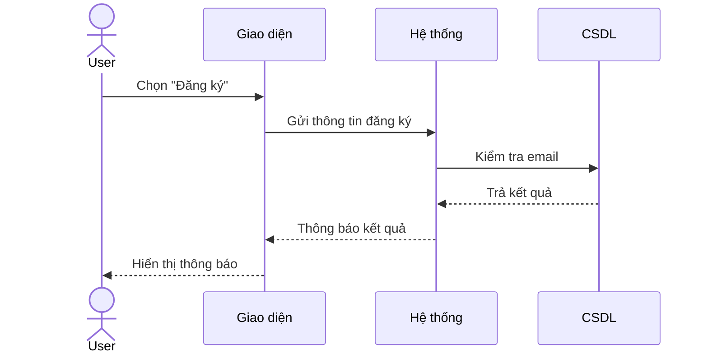

# Lab 03 – UML Thiết kế (Use Case & Sequence Diagram)

## 🎯 Mục tiêu
- Mô tả luồng tương tác chi tiết của hệ thống **Website quản lý công việc (Trello mini)**.  
- Biểu diễn bằng Use Case Diagram, Sequence Diagram.  
- Giải thích các đối tượng tham gia và thông điệp trao đổi.  

---

## 📌 1. Phân rã chức năng hệ thống
Hệ thống **Website quản lý công việc** gồm 4 nhóm chức năng chính:

1. **Quản lý tài khoản (Account)**  
   - Đăng ký  
   - Đăng nhập  
   - Cập nhật thông tin cá nhân  
   - Đăng xuất  

2. **Quản lý bảng công việc (Board)**  
   - Tạo bảng  
   - Chỉnh sửa bảng  
   - Xóa bảng  
   - Thêm thành viên  

3. **Quản lý danh sách công việc (List)**  
   - Tạo danh sách  
   - Chỉnh sửa danh sách  
   - Xóa danh sách  

4. **Quản lý thẻ công việc (Card)**  
   - Tạo thẻ  
   - Chỉnh sửa thẻ  
   - Xóa thẻ  

---

## 📌 2. Use Case Diagram
Sơ đồ use case tổng quát cho hệ thống:


**Actor:**
- **User:** sử dụng hệ thống để quản lý công việc.  
- **Admin (hoặc Chủ bảng):** có quyền nâng cao như thêm thành viên, xóa bảng.  

**Các Use Case chính:**
- Đăng ký, Đăng nhập, Đăng xuất, Cập nhật thông tin cá nhân.  
- Tạo/Chỉnh sửa/Xóa Bảng.  
- Tạo/Chỉnh sửa/Xóa Danh sách.  
- Tạo/Chỉnh sửa/Xóa Thẻ.  
- Thêm thành viên vào bảng.  

---

## 📌 3. Sequence Diagram

# USECASE.md – Website Quản lý công việc (Trello mini)

## 1. Use Case chi tiết

### 1.1 Đăng ký
- **Actor:** User  
- **Mục tiêu:** Tạo tài khoản mới để sử dụng hệ thống.  
- **Tiền điều kiện:** User chưa có tài khoản.  
- **Luồng chính:**
  1. User chọn chức năng "Đăng ký".  
  2. Hệ thống hiển thị form nhập thông tin.  
  3. User nhập thông tin (tên, email, mật khẩu).  
  4. Hệ thống kiểm tra dữ liệu.  
  5. Nếu hợp lệ → lưu vào CSDL.  
  6. Hệ thống thông báo đăng ký thành công.  
- **Ngoại lệ:** Email đã tồn tại hoặc dữ liệu không hợp lệ.  
- **Kết quả:** User có tài khoản hợp lệ.  

---

### 1.2 Đăng nhập
- **Actor:** User  
- **Mục tiêu:** Truy cập hệ thống bằng tài khoản.  
- **Tiền điều kiện:** User đã đăng ký.  
- **Luồng chính:**
  1. User nhập email + mật khẩu.  
  2. Hệ thống xác thực thông tin trong CSDL.  
  3. Nếu hợp lệ → cho phép truy cập.  
- **Ngoại lệ:** Sai thông tin → báo lỗi.  
- **Kết quả:** User đăng nhập thành công.  

---

### 1.3 Quản lý bảng (Board)
- **Actor:** User  
- **Mục tiêu:** Quản lý bảng công việc.  
- **Tiền điều kiện:** User đã đăng nhập.  
- **Luồng chính:**  
  - Tạo bảng mới.  
  - Sửa tên bảng.  
  - Xóa bảng.  
  - Thêm thành viên.  
- **Kết quả:** Danh sách bảng được cập nhật.  

---

### 1.4 Quản lý danh sách (List)
- **Actor:** User  
- **Mục tiêu:** Quản lý danh sách công việc trong bảng.  
- **Tiền điều kiện:** User đã đăng nhập và chọn bảng.  
- **Luồng chính:**  
  - Tạo danh sách mới.  
  - Sửa tên danh sách.  
  - Xóa danh sách.  
- **Kết quả:** Danh sách được cập nhật trong bảng.  

---

### 1.5 Quản lý thẻ (Card)
- **Actor:** User  
- **Mục tiêu:** Quản lý công việc chi tiết bằng thẻ.  
- **Tiền điều kiện:** User đã đăng nhập và chọn danh sách.  
- **Luồng chính:**  
  - Tạo thẻ mới.  
  - Sửa thẻ.  
  - Xóa thẻ.  
- **Kết quả:** Thẻ được cập nhật trong danh sách.  

---

### 1.6 Thêm thành viên
- **Actor:** Admin (hoặc Chủ bảng).  
- **Mục tiêu:** Mời thành viên khác tham gia bảng.  
- **Tiền điều kiện:** Admin đã đăng nhập và có quyền quản trị bảng.  
- **Luồng chính:**  
  1. Admin chọn chức năng "Thêm thành viên".  
  2. Nhập email của thành viên.  
  3. Hệ thống kiểm tra email tồn tại.  
  4. Nếu hợp lệ → thêm vào bảng.  
- **Ngoại lệ:** Email không tồn tại → báo lỗi.  
- **Kết quả:** Thành viên được thêm vào bảng.  

---

## 2. Sequence Diagram

### ## 2.1 Đăng ký

2.2 Đăng nhập
```mermaid
Sao chép mã
sequenceDiagram
    actor User
    participant UI as Giao diện
    participant Auth as Hệ thống xác thực
    participant DB as CSDL

    User ->> UI: Nhập email + mật khẩu
    UI ->> Auth: Gửi thông tin đăng nhập
    Auth ->> DB: Kiểm tra dữ liệu
    DB -->> Auth: Trả kết quả
    Auth -->> UI: Thông báo kết quả
    UI -->> User: Hiển thị kết quả
```
2.3 Tạo bảng
```mermaid
Sao chép mã
sequenceDiagram
    actor User
    participant UI as Giao diện
    participant Sys as Hệ thống
    participant DB as CSDL

    User ->> UI: Chọn "Tạo bảng"
    UI ->> Sys: Gửi yêu cầu tạo bảng
    Sys ->> DB: Lưu bảng mới
    DB -->> Sys: Xác nhận
    Sys -->> UI: Phản hồi kết quả
    UI -->> User: Hiển thị bảng mới
```
2.4 Tạo danh sách
```mermaid
Sao chép mã
sequenceDiagram
    actor User
    participant UI as Giao diện
    participant Sys as Hệ thống
    participant DB as CSDL

    User ->> UI: Chọn "Tạo danh sách"
    UI ->> Sys: Gửi yêu cầu tạo danh sách
    Sys ->> DB: Lưu danh sách mới
    DB -->> Sys: Xác nhận
    Sys -->> UI: Phản hồi kết quả
    UI -->> User: Hiển thị danh sách mới
```
2.5 Tạo thẻ
```mermaid
Sao chép mã
sequenceDiagram
    actor User
    participant UI as Giao diện
    participant Sys as Hệ thống
    participant DB as CSDL

    User ->> UI: Chọn "Tạo thẻ"
    UI ->> Sys: Gửi yêu cầu tạo thẻ
    Sys ->> DB: Lưu thẻ mới
    DB -->> Sys: Xác nhận
    Sys -->> UI: Phản hồi kết quả
    UI -->> User: Hiển thị thẻ mới
```
2.6 Thêm thành viên
```mermaid
Sao chép mã
sequenceDiagram
    actor Admin as Chủ bảng
    participant UI as Giao diện
    participant Sys as Hệ thống
    participant DB as CSDL

    Admin ->> UI: Chọn "Thêm thành viên"
    UI ->> Sys: Gửi email thành viên
    Sys ->> DB: Kiểm tra email
    DB -->> Sys: Trả kết quả
    Sys ->> DB: Thêm thành viên (nếu hợp lệ)
    DB -->> Sys: Xác nhận
    Sys -->> UI: Phản hồi kết quả
    UI -->> Admin: Hiển thị danh sách thành viên
```
